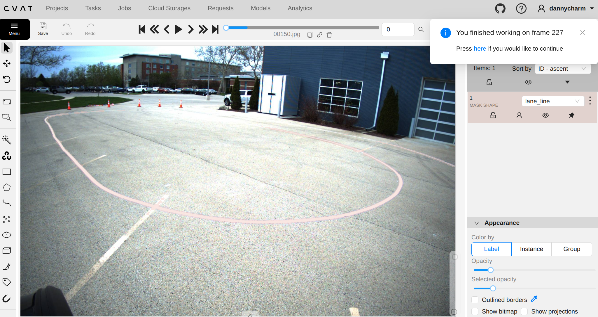
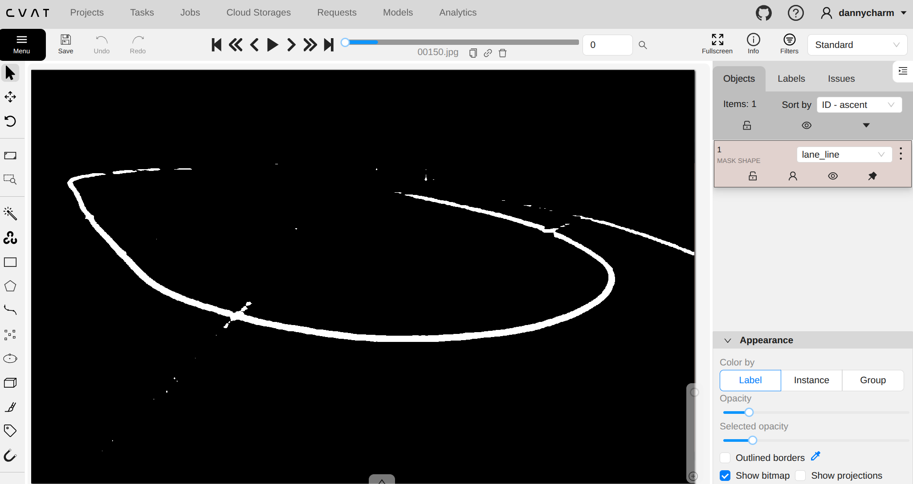

::: {.hero-section}

# Project Matrix: Autonomous Robotaxi Summoning {Matrix}

::: {.subtitle}
A Full-Stack Autonomy Pipeline for the Polaris GEM e2: From GPS Summoning to Precision Parking
:::

::: {.author-list}
[**Praise Daniels**](https://www.linkedin.com/in/praise-daniels-b732b91b8/)^1^,
[**Sanath Nair**](https://www.linkedin.com/in/sanathnair09/)^1^,
[**Aryan Chauhan**](https://www.linkedin.com/in/aryan-chauhan-/)^1^,
[**Prachit Gupta**](https://www.linkedin.com/in/prachit-gupta-60a210240/)^1^
:::

::: {.affiliation-list}
^1^University of Illinois Urbana-Champaign | ECE 484: Principles of Safe Autonomy
:::

::: {.button-row}
<!-- [[ Technical Report]{.btn-text}](docs/report.pdf){.btn .btn-primary} -->
[[ Simulation Demo]{.btn-text}](#video){.btn .btn-primary}
[[ Codebase]{.btn-text}](https://github.com/safeautonomy-illinois-students/project-site-matrix){.btn .btn-primary}
:::

:::

::: {.section-container .progress-section}
## Project progress {.section-title}

::: {.progress-timeline}
::: {.progress-milestone .progress-milestone-past}
#### Week of Mar 23 - Safety training and simulation setup

- Completed course safety training required for GEM field work
- Setup up GEM + highbay environment simulation for local testing

[More Info](#progress-week-323){.btn .progress-more-btn}
:::

::: {.progress-milestone .progress-milestone-past}
#### Week of Mar 30 - Code and workspace on the vehicle

- Deployed repositories and the ROS 2 workspace onto the GEM vehicle

[More Info](#progress-week-330){.btn .progress-more-btn}
:::

::: {.progress-milestone .progress-milestone-past}
#### Week of Apr 6 - Rosbags plus MPC and YOLO start

- Began collecting vehicle rosbags for offline replay and tuning
- Started MPC controller work and YOLO-based detection integrated with bag playback and sim

[More Info](#progress-week-406){.btn .progress-more-btn}
:::

::: {.progress-milestone .progress-milestone-past}
#### Week of Apr 13 - Logging issues, MPC and YOLO testing

- Still working to pull rosbags off the vehicle (issues transfering files off vehicle)
- Continued debugging and testing MPC and YOLO on bags and in closed-loop simulation

[More Info](#progress-week-413){.btn .progress-more-btn}
:::

::: {.progress-milestone .progress-milestone-current}
#### Week of Apr 20 - Finalize MPC and YOLO, test on rosbags

- Finalize MPC and YOLO for the integrated summon pipeline
- Begin testing on vehicle rosbags as soon as bags are available

[More Info](#progress-week-420){.btn .progress-more-btn}
:::

:::

:::

::: {.section-container}
## Abstract {.section-title}

::: {.abstract-text}
We present a constrained-optimization-based autonomy framework for summoning a full-scale Polaris GEM e2 to a user-specified GPS target from a phone interface. Starting from a parked state, the vehicle must enter the lane, follow the drivable region, react to stop signs and obstacles, resume when the path clears, and stop within 2 m of the goal. Our stack centers on Model Predictive Control (MPC), which repeatedly solves a finite-horizon optimization problem and applies the first control input in closed loop. The formulation balances lane-center tracking and control effort while enforcing vehicle dynamics, actuator limits, obstacle avoidance, and terminal goal constraints. References are generated from camera-based drivable-region detection, bird's-eye-view transformation, and polynomial fitting of the lane centerline, while GPS routing and multimodal perception provide destination and hazard information. Despite the computational demands of MPC, the onboard AStuff Spectra 2 platform provides sufficient headroom for online optimization. The resulting architecture directly targets the summon deliverables through unified, safety-aware control.
:::

:::

::: {.section-container}
## System Overview {.section-title}

::: {.content-text .overview-intro}
The system is organized as a perception-planning-control pipeline for autonomous summoning on the Polaris GEM e2. A phone-provided GPS target is converted into a route and lane-entry decision, perception modules estimate the drivable corridor and nearby hazards, and a constrained controller generates feasible vehicle actions that respect safety and goal-reaching requirements.
:::

### Core Modules {.subsection-title}

::: {.overview-grid}

::: {.overview-card}
#### GPS Coordinate Receiver
Receives a destination from the provided phone application and publishes the target GPS coordinates to the autonomy stack.
:::

::: {.overview-card}
#### Path Planner
Determines how the vehicle exits the parking area, selects the lane-entry direction, and routes the car toward the destination using the current scene geometry and target location.
:::

::: {.overview-card}
#### Park-to-Drive Controller
Handles the transition from a stationary parked configuration into a valid driving state before handing off to lane following and long-horizon control.
:::

::: {.overview-card}
#### Camera-Based Lane Following and MPC
Uses neural lane segmentation, inverse perspective mapping, and polynomial fitting to estimate the lane centerline, then solves a receding-horizon MPC problem for longitudinal and lateral control.
:::

::: {.overview-card}
#### Obstacle Detection and Distance Estimation
Combines stop-sign recognition and obstacle ranging from the stereo camera and top LiDAR to trigger safe stopping, clearance checking, and automatic resume behavior.
:::

:::

### Sensors and Computation{.subsection-title}

::: {.spec-grid}

::: {.spec-card}
#### Front Stereo Camera
**ZED2**

Provides forward-facing RGB imagery and depth cues for lane segmentation, stop-sign recognition, and short-range geometric reasoning.
:::

::: {.spec-card}
#### Top LiDAR
**Ouster OS1-128**

Supplies dense 3D range data for obstacle detection, clearance estimation, and robust environmental awareness beyond image-only perception.
:::

::: {.spec-card}
#### Onboard Compute
**AStuff Spectra 2**

- **CPU:** Intel Xeon E-2278G 3.40 GHz x16
- **GPU:** NVIDIA RTX A4000

This platform supports real-time perception and the computational load of online MPC optimization.
:::

:::

### Software Stack {.subsection-title}

::: {.pill-row}
[ROS 2 Humble]{.stack-pill}
[Polaris GEM e2 platform]{.stack-pill}
[Gazebo Ignition simulator]{.stack-pill}
[Phone app GPS interface]{.stack-pill}
[C++ solver]{.stack-pill}
:::

::: {.content-text .overview-footnote}
Together, these modules provide the information flow needed for the summon task: destination input drives routing, perception scans the environment for free spaces, obstacles and stop signs, and the controller converts those updates into safe, dynamically feasible commands.
:::

:::

::: {.section-container}
## MPC Problem Formulation {.section-title}

::: {.content-text .mpc-compact}
We model lane tracking and goal reaching as a receding-horizon optimization problem. The reference state $x_{ref,k}$ is obtained from the lane centerline estimated using neural drivable-region segmentation, bird's-eye-view transformation, and polynomial fitting.
:::

### MPC Flow in Plain Language {.subsection-title}

::: {.mpc-flowchart}
::: {.mpc-flow-step}
#### 1. Sense the scene
Read odometry, lane-center estimates, stop-sign detections, and obstacle locations from the camera and LiDAR stack.
:::

::: {.mpc-flow-arrow}
$\rightarrow$
:::

::: {.mpc-flow-step}
#### 2. Build a short prediction
Use the current vehicle state and a finite horizon to predict where the car could go over the next few seconds.
:::

::: {.mpc-flow-arrow}
$\rightarrow$
:::

::: {.mpc-flow-step}
#### 3. Score each candidate plan
Penalize plans that leave the lane center, use aggressive control, or finish far from the target.
:::

::: {.mpc-flow-arrow}
$\rightarrow$
:::

::: {.mpc-flow-step}
#### 4. Enforce safety constraints
Reject plans that violate steering and acceleration limits, leave the drivable corridor, or get too close to obstacles.
:::

::: {.mpc-flow-arrow}
$\rightarrow$
:::

::: {.mpc-flow-step}
#### 5. Apply only the first action
Send the first safe command to the GEM, then repeat the full optimization at the next control tick with fresh measurements.
:::
:::

::: {.mpc-equation}
$$
\begin{aligned}
\min_{\{x_k,u_k\}} \quad
& \sum_{k=0}^{N-1} \|x_k - x_{ref,k}\|_Q^2
+ \|u_k\|_R^2
+ \|\Delta u_k\|_S^2 \\
& + \|x_N - x_{goal}\|_P^2 \\
\text{s.t.} \quad
& x_{k+1} = A_k x_k + B_k u_k + c_k, \\
& \delta_{\min} \le \delta_k \le \delta_{\max}, \quad
  a_{\min} \le a_k \le a_{\max}, \\
& x_k \in \mathcal{X}_{free}, \\
& d(x_k,\mathcal{O}_i) \ge d_{\text{safe}}, \quad \forall i, \\
& \|x_N - x_{goal}\| \le \epsilon .
\end{aligned}
$$
:::

::: {.content-text .mpc-compact}
The cost penalizes lane-center deviation, control effort, and control variation, while the terminal term enforces convergence near the GPS goal. The constraints encode actuator bounds, locally linearized vehicle dynamics, drivable-region consistency, obstacle clearance, and the final stopping tolerance.

The original problem is nonlinear because the vehicle dynamics and obstacle-distance constraints are nonlinear, and is therefore non-convex in its full form. For real-time deployment, we solve a locally linearized sparse quadratic program at each update. A warm-started solver such as **OSQP** is a good fit for this approximation because it is efficient for quadratic objectives with linear constraints, integrates cleanly with C++, and offers more predictable timing than a full nonlinear solve. The MPC optimization runs on a dedicated C++ thread, while ROS 2 callbacks independently update odometry, lane geometry, LiDAR obstacles, stereo depth, and stop-sign detections.
:::

### What the Cost Function Means {.subsection-title}

::: {.mpc-cost-grid}
::: {.mpc-cost-card}
#### Tracking term
`||x_k - x_ref,k||_Q^2`

This keeps the predicted state near the lane centerline and desired heading/speed. In simple terms, it asks the car to stay where the reference path says it should be.
:::

::: {.mpc-cost-card}
#### Control effort term
`||u_k||_R^2`

This discourages unnecessarily large throttle, braking, or steering actions. It helps avoid aggressive commands that make the ride jerky or waste control authority.
:::

::: {.mpc-cost-card}
#### Smoothness term
`||Δu_k||_S^2`

This penalizes sudden changes between one control input and the next. It is what makes the controller behave smoothly instead of oscillating or over-correcting.
:::

::: {.mpc-cost-card}
#### Terminal term
`||x_N - x_goal||_P^2`

This gives the optimizer a reason to finish the horizon pointed toward the final destination, not just do well over the next instant.
:::
:::

::: {.mpc-term-legend}
::: {.mpc-term-item}
**State $x_k$**: the predicted vehicle position, velocity, and heading-related quantities at step $k$.
:::

::: {.mpc-term-item}
**Reference $x_{ref,k}$**: the lane-center target generated from segmentation, BEV, and polynomial fitting.
:::

::: {.mpc-term-item}
**Control $u_k$**: the command applied by the controller, such as acceleration and steering action.
:::

::: {.mpc-term-item}
**$\Delta u_k$**: the difference between consecutive control commands, used to measure abruptness.
:::

::: {.mpc-term-item}
**$Q, R, S, P$**: weighting matrices that decide how much the controller cares about tracking, effort, smoothness, and goal-reaching.
:::
:::

::: {.content-text .mpc-compact}
In the implementation, these weights become tuning knobs. Increasing $Q$ makes the car follow the lane reference more tightly, increasing $R$ makes it more conservative with control inputs, increasing $S$ makes the response smoother, and increasing $P$ makes the optimizer care more about ending the horizon near the destination.
:::
:::

::: {.section-container}
## Tentative Plan and Work Allocation {.section-title}

| Evaluation Item | Planned Method | Owner(s) |
|---|---|---|
| **Detect the drivable region (lane following)** | Use a neural network to segment the lane, apply a bird's-eye-view transformation, and recover the instantaneous lane geometry from the transformed scene. | **Praise** |
| **Generate waypoints to the destination location** | Perform curve fitting in the BEV frame and use MPC to generate both trajectory and control inputs, with obstacle avoidance and vehicle dynamics enforced through the constraints. | **Aryan, Prachit** |
| **Ensure the car stays in the drivable region for the entire journey** | Encode lane tracking through the MPC cost and maintain corridor consistency through explicit constraints on the predicted state. | **Prachit, Praise** |
| **Stop completely and automatically when an obstacle or stop sign is detected** | Use stereo-LiDAR sensor fusion for obstacle detection and distance estimation, together with YOLOv8-based stop-sign detection from the front stereo camera. | **Sanath** |
| **Resume automatically once the obstacle is removed** | Let the planning layer resume motion only when the path is clear and a viable waypoint sequence can be generated again. | **Aryan, Sanath** |
| **Stop within 2 m of the goal** | Use terminal planning and low-speed final approach logic to satisfy the stopping tolerance near the destination. | **Prachit** |

:::

::: {.section-container}
## Week of March 23 - safety training and simulation {#progress-week-323 .section-title}

::: {.content-text}
This week focused on course safety training for work around the GEM and on simulation setup. The clip below walks through the simulator setup used for later MPC and perception pipelines.
:::

::: {.video-container}

:::
:::

::: {.section-container}
## Week of March 30 - onboard software on the GEM {#progress-week-330 .section-title}

::: {.content-text}
Setup the gem_ws repository on the vehicle and testing that all the included scripts worked. In addition, verified that all the sensors and modules are properly working and begin brainstorming what sensors will be needed and how we would use them.
:::
:::

::: {.section-container}
## Week of April 6 - rosbags and MPC & YOLO development {#progress-week-406 .section-title}

::: {.content-text}
We began recording vehicle rosbags for offline analysis and parallelized MPC tuning with YOLO-based detection work. The YOLO clip shows representative signage-style detections used to iterate on thresholds and throughput. The MPC clips contrast baseline lane tracking with obstacle-aware behavior (stop and resume when the corridor clears), which matches the summon-style requirements we are driving toward.
:::

:::

::: {.section-container}
## Week of April 13 - rosbag transfer, debugging, and testing {#progress-week-413 .section-title}

::: {.content-text}
We continued trying to get rosbags off the GEM reliably; we ran into issues with file trasnfer that resulted in three usb drives getting corrupted. In parallel we debugged and tested MPC and YOLO in the sim.

::: {.video-container}

:::

::: {.mpc-video-grid}

::: {.mpc-video-item}
::: {.video-subtitle}
No Obstacle Avoidance
:::

::: {.video-container}

:::
:::

::: {.mpc-video-item}
::: {.video-subtitle}
Obstacle Avoidance
:::

::: {.video-container}

:::
:::

:::

:::
:::

::: {.section-container}
## Week of April 20 - finalize MPC and YOLO, rosbag testing, lane annotation, ERFNet fine-tuning, and BEV pipeline {#progress-week-420 .section-title}

::: {.content-text}
This week we plan to finalize the MPC and YOLO branches so perception outputs and controller constraints line up with the summon requirements, then move from simulator-only checks to **testing on vehicle rosbags** as the primary regression loop. That includes stabilizing bag export from the GEM, replaying representative routes in the office, and closing any timing or topic mismatches before the next on-car session. In parallel, we plan to finalize the full lane-perception pipeline: image annotation, neural network fine-tuning, and bird's-eye-view (BEV) transformation.
:::
:::

::: {.cvat-figure-grid}

::: {.cvat-figure-item}
::: {.figure-caption}
Raw frame from the front-right camera loaded in CVAT
:::
{.cvat-figure width="50%"}
:::

::: {.cvat-figure-item}
::: {.figure-caption}

::: {.cvat-figure-item}
::: {.figure-caption}
Lane Mask Annotation
:::
{.cvat-figure width="50%"}
:::

::: {.cvat-figure-item}
::: {.figure-caption}

::: {.section-container}
## References {.section-title}

::: {.content-text}
1. John Duchi, with help from Stephen Boyd and Jacob Mattingley, *Sequential Convex Programming*, notes for EE364b, Stanford University, Spring 2018. [PDF](https://web.stanford.edu/class/ee364b/lectures/seq_notes.pdf)
2. David Shim, Hoam Chung, Hyoun Jin Kim, and Shankar Sastry, "Autonomous Exploration In Unknown Urban Environments For Unmanned Aerial Vehicles," *AIAA Guidance, Navigation, and Control Conference and Exhibit*, 2005. [DOI](https://doi.org/10.2514/6.2005-6478)
:::

:::

::: {.site-footer}
This project was developed for **ECE 484: Principles of Safe Autonomy** at UIUC.
:::
